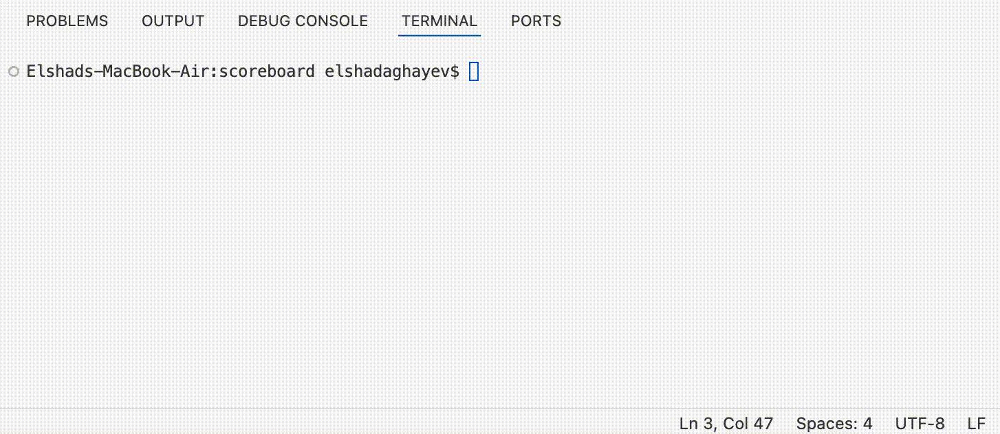

# Scoreboard (TypeScript)

A small TypeScript library to manage sport matches in memory.
You can start matches, update scores, finish matches, and get a live summary.
It also supports events (start / update / finish).

## What is inside

- **Team**: stores team name and score
- **Match**: stores two teams, start/finish time, and match state
- **Scoreboard**: main class to control matches
- **InMemoryStorage**: simple memory storage for matches
- **RankStrategy**: sorts matches for `getSummary()`

### Live Scoreboard Simulation Demo



### Folder tree:

```
src
├── adapters
│ ├── InMemoryStorage.ts
│ └── RankStrategy.ts
├── core
│ ├── Match.ts
│ ├── Scoreboard.ts
│ ├── Team.ts
│ └── interfaces
│ ├── IClock.ts
│ ├── IMatchRepository.ts
│ └── IRankStrategy.ts
└── index.ts
```

## Install

### If you publish it to npm:

```bash
npm i scoreboard
```

### If you use it locally:

```bash
npm i
```

### Build

```bash
npm run build
```

### Run tests

```bash
npm test
```

Tests use **Jest + ts-jest**.

## Quick example

```typescript
import { Scoreboard, Match, Team } from "./src"; // or from "scoreboard npm package or ./dist folder after building"

const board = new Scoreboard();

const match = new Match("m1", new Team("Home"), new Team("Away"));

board.startNewMatch(match);
board.updateScore("m1", { homeTeam: 1, awayTeam: 0 });

console.log(board.getSummary());

board.finish("m1");
console.log(board.getSummary());
```

## Events

`Scoreboard` extends `EventEmitter` and emits 3 events:

- `matchStarted` -> gives the `Match`
- `updatedScore` -> gives the `matchId, params: Required<UpdateParams>`
- `matchFinished` -> gives the `matchId`

Example:

```typescript
const board = new Scoreboard();

board.on("matchStarted", (match) => {
  console.log("Started:", match.id);
});

board.on("updatedScore", (matchId) => {
  console.log("Score updated:", matchId);
});

board.on("matchFinished", (matchId) => {
  console.log("Finished:", matchId);
});
```

## API (main behavior)

### Team

- `new Team(name)`
- `getScore()` -> number
- `setScore(score)` -> sets score
   Throws error if score is negative.

### Match
- `new Match(id, homeTeam, awayTeam)`
- `start(time)` -> sets startedAt only once
- `finish(time)` -> works only if match was started, and only once
- `isOngoing()` -> boolean
- `isFinished()` -> boolean
- `whenStarted()` -> time or undefined
- `whenFinished()` -> time or undefined

### Scoreboard

- `new Scoreboard(clock?, storage?)`
    - `clock` default is `Date` (uses `Date.now()`)
    - `storage` default is `InMemoryStorage`

Methods:

- `startNewMatch(match)`
    - calls `match.start(clock.now())`
    - saves match
    - emits `matchStarted`
    - throws error if the same match id is already started and not finished
- `updateScore(matchId, { homeTeam, awayTeam })`
    - updates scores in storage
    - emits `updatedScore`
    - errors from storage are not hidden (they are thrown)
- `finish(matchId)`
    - finds match, calls `match.finish(clock.now())`
    - deletes match from storage
    - emits `matchFinished`
- `getSummary(strategy?)`
    - returns only ongoing matches
    - deletes finished matches from storage
    - default strategy is `RankStrategy`

## InMemoryStorage rules

- starts empty
- `save(match1, match2, ...)` stores matches
- if you save a match with the same id, it replaces the old one
- `findById(id)` throws error if not found
- `delete(id)` removes and returns match, throws error if not found
- `update(id, { homeTeam, awayTeam })` changes team scores
- `clearAll()` removes everything
- `findAll()` returns all stored matches

## Dev dependencies

Main dev tools (from `package.json`):
- TypeScript
- Jest + ts-jest
- tsx (for examples)

Scripts:

- `npm test` -> run tests
- `npm run build` -> compile with tsc
- `npm run example` -> run examples with ts-node